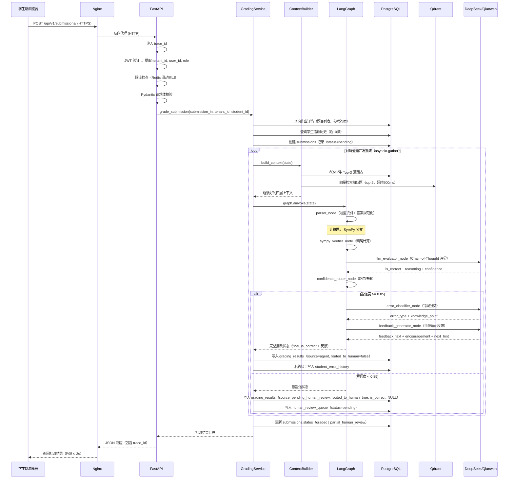
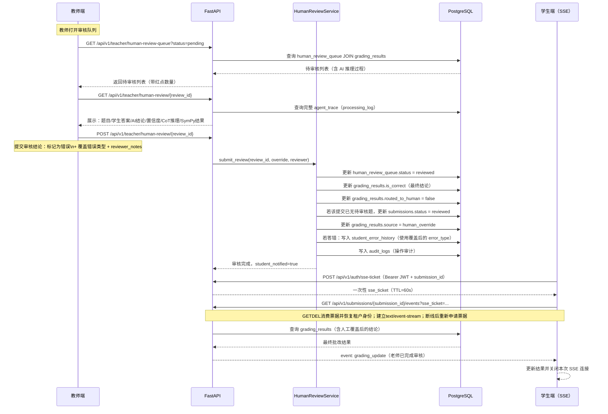
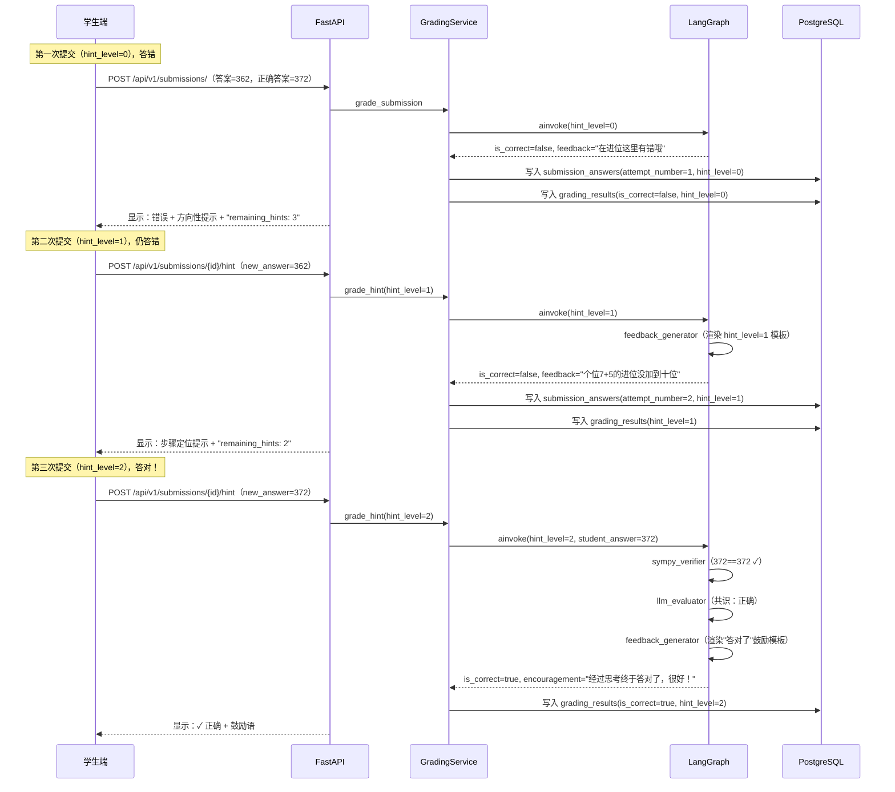
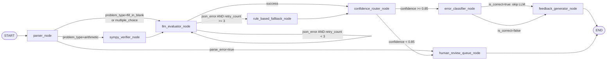
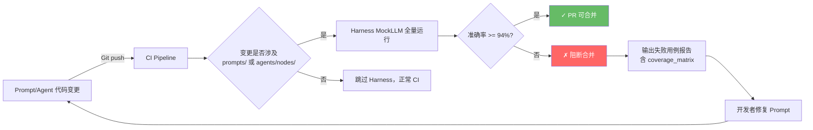
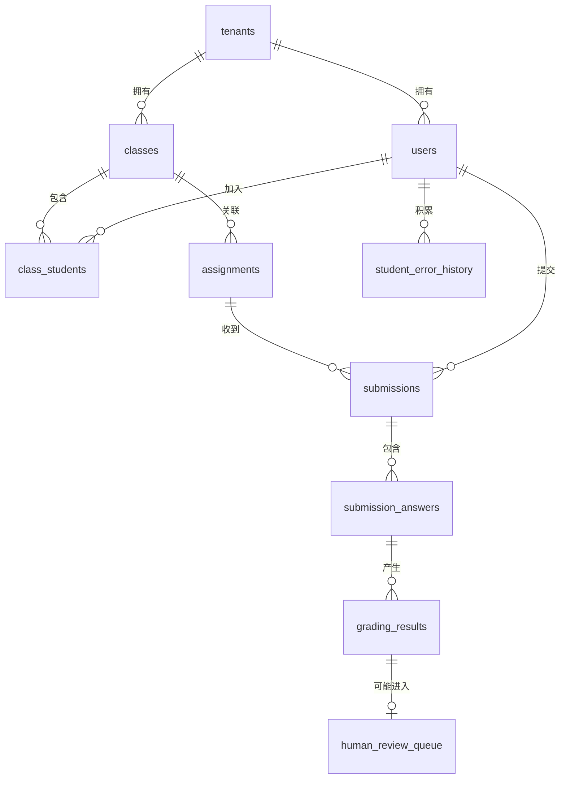

# 系统架构设计方案

**项目名称**：翱翔启航  
**文档版本**：v2.0  
**创建日期**：2026-07-19  
**最后更新**：2026-07-21
**状态**：已确认
**架构基线**：v1.0

---

## 一、概述

### 1.1 设计目标

本文档描述翱翔启航的系统架构设计，涵盖整体分层架构、核心组件职责、模块间接口、数据模型、错误处理策略、缓存策略、服务治理和测试体系。架构设计以四大 AI 工程范式为骨干，确保系统在准确性、可维护性、可扩展性三个维度达到生产级标准。

### 1.2 核心设计原则

| 原则 | 说明 | 体现 |
|------|------|------|
| **精确优先** | 计算题由 SymPy 提供数学真值，LLM 不做数字计算判断 | SymPy Verifier 节点先于 LLM Evaluator 执行 |
| **可信任** | 每次批改保存完整推理链路（agent_trace），教师可追溯 | JSONB agent_trace 字段 + HITL 界面展示 |
| **可演进** | Prompt 变更有 Harness 保护，不会静默降低准确率 | CI 门禁：准确率 < 94% 阻断合并 |
| **数据本地** | 所有学生数据存储于学校本地，LLM 调用不含个人标识 | ContextBuilder 脱敏检查 + 私有化部署 |
| **渐进降级** | LLM 不可用时降级规则匹配，系统始终可提供批改结果 | 四级降级链（主 LLM → 备 LLM → 重试 → 规则） |
| **低耦合** | 各 Agent 节点通过 GradingState 传递数据，互不直接调用 | LangGraph 状态图设计 |
| **可观测** | 每次请求有唯一 trace_id，关键操作有结构化日志 | structlog + trace_id 贯穿全链路 |

---

## 二、整体架构

### 2.1 系统分层架构

```mermaid
graph TB
    subgraph 客户端层
        A1[学生端 Web\n响应式布局]
        A2[教师端 Web\n桌面优化]
        A3[管理员端 Web\n数据管理]
    end

    subgraph API网关层 Nginx
        N1[TLS 终止\nHTTPS→HTTP]
        N2[静态资源服务\n前端文件]
        N3[反向代理\n/api/ → :8000]
    end

    subgraph API层 FastAPI Uvicorn×4
        B1[认证中间件\nJWT 验证 + 解码]
        B2[多租户中间件\nTenantContext contextvars]
        B3[限流中间件\nRedis 滑动窗口]
        B4[路由层 Routers\n分模块 APIRouter]
        B5[请求日志中间件\ntrace_id 注入]
    end

    subgraph 服务层
        C1[GradingService\n批改编排服务]
        C2[HumanReviewService\nHITL 审核服务]
        C3[AnalyticsService\n分析聚合服务]
        C4[AssignmentService\n作业管理服务]
        C5[UserService\n账户管理服务]
    end

    subgraph AI Agent层 LangGraph
        D1[parser_node\n题型解析 + 答案规范化]
        D2[sympy_verifier_node\n符号计算精确验证]
        D3[llm_evaluator_node\nCoT 语义评分 + 重试]
        D4[rule_fallback_node\n字符串匹配降级]
        D5[confidence_router_node\n置信度计算 + 路由决策]
        D6[error_classifier_node\n错误类型分类]
        D7[feedback_generator_node\n年龄适配反馈生成]
        D8[human_review_queue_node\n入队标记]
    end

    subgraph 工程范式层
        E1[Prompt工程\nJinja2模板 + 前缀缓存]
        E2[Context工程\n四层 Token 预算管理]
        E3[Harness工程\n准确率回归 + CI 门禁]
        E4[Loop工程\nJSON重试 + Hint循环 + HITL]
    end

    subgraph 基础设施层
        F1[PostgreSQL 16\n主业务数据库]
        F2[Qdrant v1.11\n向量数据库 RAG]
        F3[Redis 7\n限流 + 缓存 + 会话]
        F4[DeepSeek API\n主力 LLM]
        F5[Qianwen API\n备用 LLM + Feedback]
    end

    A1 & A2 & A3 --> N1
    N1 --> N3
    N3 --> B5
    B5 --> B1 --> B2 --> B3 --> B4
    B4 --> C1 & C2 & C3 & C4 & C5
    C1 --> E2
    E2 --> D1
    D1 -->|arithmetic| D2
    D1 -->|fill/choice| D3
    D2 --> D3
    D3 -->|JSON失败 retry<3| D3
    D3 -->|retry耗尽| D4
    D3 & D4 --> D5
    D5 -->|conf>=0.85| D6 --> D7
    D5 -->|conf<0.85| D8
    D3 & D6 & D7 --> E1
    D5 --> E4
    C1 & C2 & C3 & C4 & C5 --> F1
    E2 --> F2
    B3 --> F3
    E1 --> F4 & F5
    E3 -.->|CI验证 MockLLM| D1
```

### 2.2 请求完整生命周期（正常批改路径）



### 2.3 HITL 人工审核流程



### 2.4 Hint 学习循环流程



---

## 三、核心组件设计

### 3.1 API 层

#### 3.1.1 中间件执行链

```
HTTP 请求进入 Nginx（TLS 解密）
        │
        ▼
FastAPI 中间件链（按注册顺序执行）：
  ① RequestLoggingMiddleware   → 注入 trace_id（UUID4），记录请求开始
  ② TrustedHostMiddleware      → 校验 Host 头（防 Host 注入）
  ③ CORSMiddleware             → 校验 Origin（仅允许内网域名）
  ④ RateLimitMiddleware        → Redis 滑动窗口限流（按 tenant_id + 接口分组）
  ⑤ AuthenticationMiddleware   → JWT 解码验证（公开接口白名单跳过）
  ⑥ TenantContextMiddleware    → 将 tenant_id 存入 contextvars._tenant_ctx
        │
        ▼
路由层 → 服务层 → Agent 层
        │
        ▼
ResponseLoggingMiddleware → 记录响应状态码、耗时、trace_id
```

**设计决策**：使用 Python `contextvars` 而非在函数签名中传递 `tenant_id`，避免所有业务函数都需要额外参数，同时保证 asyncio 协程间的隔离（每个协程有独立的 context 副本）。

#### 3.1.2 路由设计

| 路由前缀 | 模块 | 核心端点 |
|---------|------|---------|
| `/api/v1/auth` | 认证 | POST `/login`，POST `/change-password`，POST `/logout` |
| `/api/v1/submissions` | 答案提交 | POST `/`，GET `/{id}`，POST `/{id}/hint`，GET `/` |
| `/api/v1/assignments` | 作业管理 | GET `/`，POST `/`，GET `/{id}`，PATCH `/{id}`，GET `/{id}/stats` |
| `/api/v1/teacher` | 教师端 | GET `/human-review-queue`，GET `/human-review/{id}`，POST `/human-review/{id}`，GET `/dashboard`，GET `/students/{id}/analytics` |
| `/api/v1/problems` | 题库管理 | GET `/`，POST `/`，GET `/{id}`，PUT `/{id}`，DELETE `/{id}`，POST `/bulk-import` |
| `/api/v1/admin` | 管理员 | 用户/班级/统计管理 |
| `/api/v1/ops` | 运维 | Harness 触发、RAG 导入、系统健康、任务查询 |
| `/health` | 健康检查 | GET（公开，无需认证） |

**统一响应格式**：
```json
{
  "code": 0,
  "message": "success",
  "data": { },
  "trace_id": "req-550e8400-e29b-41d4-a716-446655440000"
}
```

**统一错误响应格式**（Pydantic 校验失败）：
```json
{
  "code": 4022,
  "message": "请求参数校验失败",
  "detail": [
    {"loc": ["body", "answers", 0, "answer_text"], "msg": "ensure this value has at most 500 characters", "type": "value_error.any_str.max_length"}
  ],
  "trace_id": "req-..."
}
```

---

### 3.2 LangGraph Agent 图

#### 3.2.1 节点职责详解

| 节点 | 类型 | 职责 | 使用 LLM | 超时 |
|------|------|------|---------|------|
| `parser_node` | async LLM | 识别题型（arithmetic/fill_in_blank/multiple_choice）、提取操作数、规范化学生答案（中文数字、单位、分数格式统一化）、检测空答案 | DeepSeek-V3 | 10s |
| `sympy_verifier_node` | sync Pure Python | 对 arithmetic 题型：构造 SymPy 表达式 → 精确计算期望答案 → 与规范化学生答案比对 → 返回 `sympy_is_correct`、`sympy_expected`；检测进位错误特征（差值为10的整数幂） | 无 | 1s |
| `llm_evaluator_node` | async LLM + Retry | 四步 Chain-of-Thought 推理（理解题意 → 确定正确解法 → 分析学生答案 → 得出结论）；JSON 格式失败时注入错误描述重试（max 3次）；retry 耗尽触发 fallback | DeepSeek-V3（1-4年级） / Qianwen-Max（5-6年级） | 30s（首次）|
| `rule_based_fallback_node` | sync Pure Python | LLM 失败时的保底方案：直接比较规范化后的学生答案与参考答案（字符串相等 + 数值相等双重比对）；confidence 固定 0.80 | 无 | 0.1s |
| `confidence_router_node` | sync Pure Python | 综合 SymPy 和 LLM 的结论计算最终置信度；冲突时以 SymPy 为准并降置信度到 0.75；路由决策：confidence ≥ 0.85 → 继续；< 0.85 → HITL | 无 | 0.1s |
| `error_classifier_node` | async LLM | 对答错的情况分类（计算错误/审题错误/进位错误/概念错误）；提取知识点标签（如"三位数加法进位"）；对答对的情况直接返回"无错误"（跳过 LLM 调用） | DeepSeek-V3 | 15s |
| `feedback_generator_node` | async LLM | 根据年级（1-2/3-4/5-6）、hint_level（0-3）、is_correct 和 error_type 生成中文反馈；包含：主反馈文本、鼓励语、下一个 hint（若 hint_level < 3）| Qianwen-Max | 20s |
| `human_review_queue_node` | sync | 写入 HITL 标记到 GradingState；由 GradingService 负责实际的数据库写入 | 无 | 0.1s |

#### 3.2.2 图结构与条件边



#### 3.2.3 GradingState 核心字段（完整版）

```python
from typing import TypedDict, Optional

class GradingState(TypedDict):
    # ── 输入字段（外部注入）──────────────────────────
    submission_id:      str
    tenant_id:          str
    student_id:         str
    assignment_id:      str
    problem_id:         str
    problem_text:       str
    student_answer:     str
    reference_answer:   str
    grade_level:        int                     # 1-6
    curriculum_version: str                     # 人教版 | 北师大版
    hint_level:         int                     # 0-3
    attempt_number:     int                     # 1-4

    # Context 层注入
    student_error_history: list[dict]           # 近10条错误历史
    similar_problems:      list[dict]           # RAG 检索结果（top-2）

    # ── Parser 节点输出 ──────────────────────────────
    parsed_problem: Optional[dict]              # {problem_type, operands, operators, normalized_student_answer, normalized_reference_answer, raw_expression}
    parse_error:    bool                        # 题目无法解析时为 True

    # ── SymPy 节点输出 ──────────────────────────────
    sympy_expected:    Optional[str]            # SymPy 计算的期望答案
    sympy_is_correct:  Optional[bool]           # 学生答案是否与 SymPy 结果一致
    sympy_confidence:  float                    # 1.0（SymPy 成功）/ 0.0（SymPy 失败）
    sympy_carry_error: bool                     # 进位错误特征检测结果

    # ── LLM Evaluator 节点输出 ──────────────────────
    llm_is_correct:  Optional[bool]
    llm_reasoning:   Optional[str]              # Chain-of-Thought 推理文本
    llm_confidence:  float
    retry_count:     int                        # JSON 修复重试次数（0-3）
    last_llm_error:  Optional[str]              # 上次 JSON 解析失败的原因

    # ── 规则降级节点输出 ─────────────────────────────
    fallback_used:  bool                        # 是否使用了规则降级

    # ── 置信度路由节点输出 ──────────────────────────
    final_is_correct:  Optional[bool]           # 最终批改结论
    confidence_score:  float                    # 最终置信度（0.0-1.0）
    routed_to_human:   bool
    human_review_reason: Optional[str]          # low_confidence | sympy_llm_conflict | parse_error | llm_fallback

    # ── 错误分类节点输出 ─────────────────────────────
    error_type:      Optional[str]              # 计算错误|审题错误|进位错误|概念错误|无错误
    error_detail:    Optional[str]              # 错误的具体说明
    knowledge_point: Optional[str]              # 关联知识点标签

    # ── 反馈生成节点输出 ─────────────────────────────
    feedback_text:   Optional[str]              # 主反馈内容（面向学生）
    encouragement:   Optional[str]              # 鼓励语
    next_hint:       Optional[str]              # 下一个 hint 的预览（hint_level < 3 时有值）

    # ── 全局审计字段 ─────────────────────────────────
    processing_log:  list[str]                  # 各节点执行摘要日志
    total_duration_ms: int                      # 总耗时
```

---

### 3.3 四大工程范式实现

#### 3.3.1 Prompt 工程

**模板体系**（Jinja2）：

```
prompts/templates/
├── static/
│   └── curriculum_renjiao.j2      ← 静态前缀，12变体（6年级×2课程版本），服务启动时预热
├── parser/
│   ├── system.j2                  ← 题型定义 + JSON Schema 约束（+3个 few-shot 示例）
│   └── user.j2                    ← 题目文本 + 学生答案（动态注入）
├── evaluator/
│   ├── system.j2                  ← CoT 四步推理规范 + 评分标准
│   ├── retry.j2                   ← 重试时注入：上次错误描述 + 格式要求强化
│   └── user.j2                    ← 题目 + SymPy 结果（如有）+ 学生历史 + 当前答案
├── error_classifier/
│   ├── system.j2                  ← 四类错误定义 + 分类决策树 + 典型示例
│   └── user.j2                    ← 题目 + 学生答案 + LLM 推理结果（动态注入）
└── feedback_generator/
    ├── system_grade_1_2.j2        ← 低年级：极简风格、词汇约束
    ├── system_grade_3_4.j2        ← 中年级：先肯定再指导
    ├── system_grade_5_6.j2        ← 高年级：完整数学术语
    ├── hint_rules.j2              ← hint_level 0-3 内容规范（可缓存，注入 system 前缀）
    └── user.j2                    ← 题目 + 错误类型 + 知识点 + hint_level + attempt_number
```

**缓存策略**：

```
服务启动时（startup event）：
  1. 预渲染 12 个静态变体 → 存入进程内 dict（key: grade_level × curriculum_version）
  2. 向 DeepSeek 和 Qianwen 各发送 12 次 no-op 预热请求（max_tokens=1）
     → 触发服务端 KV Cache，后续请求命中缓存省 ~60% input tokens
  3. 启动日志打印：已预热 N 个 Prompt 前缀变体，Prompt 版本 hash: {git_hash}

稳态：
  - 静态前缀：进程内 dict，不过期
  - 动态部分（Student/Problem层）：每次请求实时组装，不缓存
  - LLM 服务端缓存命中率：目标 > 90%（通过响应头检测）
```

**模型选择策略**（`llm/selector.py`）：

| 任务节点 | 默认模型 | 备用模型 | 切换条件 |
|---------|---------|---------|---------|
| parser_node | DeepSeek-V3 | Qianwen-Max | DeepSeek HTTP 5xx / 超时3次 |
| llm_evaluator（1-4年级） | DeepSeek-V3 | Qianwen-Max | 同上 |
| llm_evaluator（5-6年级） | Qianwen-Max | DeepSeek-V3 | Qianwen HTTP 5xx / 超时3次 |
| error_classifier | DeepSeek-V3 | Qianwen-Max | 同上 |
| feedback_generator | Qianwen-Max | DeepSeek-V3 | Qianwen HTTP 5xx / 超时3次 |

**模型选择理由**：

| 模型 | 优势 | 场景 |
|------|------|------|
| DeepSeek-V3 | 结构化 JSON 输出稳定，价格低（¥1/M tokens），小学数学推理足够 | Parser、Evaluator 1-4年级、Classifier |
| Qianwen-Max | 中文表达最自然流畅，对分数/多步运算推理更强 | Feedback（中文面向学生）、Evaluator 5-6年级 |

#### 3.3.2 Context 工程

**四层 Token 预算分配**（总 4096 tokens，LLM 上下文窗口适配）：

```
┌──────────────────────────────────────────────────────────────────────┐
│ 层级          │ 预算   │ 内容                      │ 缓存     │ 更新频率  │
├──────────────────────────────────────────────────────────────────────┤
│ 静态层        │ 2000   │ 课标规则+评分规范+few-shot  │ 进程内  │ 服务重启  │
│ Session 层    │  300   │ 作业ID+提交ID（元数据）    │ 无      │ 每次请求  │
│ Student 层    │  600   │ 近10次错误滑动窗口+Top-3弱点│ 无      │ 每次请求  │
│ Problem 层    │  800   │ 题目+参考答案+RAG相似题     │ 无      │ 每次请求  │
│ 系统保留      │  396   │ 消息格式+截断标记+安全余量  │ -       │ -        │
└──────────────────────────────────────────────────────────────────────┘
```

**Token 超预算截断策略**：
1. Student 层超出 600：从最旧的错误记录开始丢弃，直到满足预算；不截断 Top-3 薄弱点摘要
2. Problem 层超出 800：优先保留题目文本和参考答案；RAG 相似题可全部丢弃；绝不截断题目文本
3. 静态层超出 2000（极少发生）：减少 few-shot 示例数量（5 → 3 → 1）

**RAG 相似题检索规范**：
```python
async def retrieve_similar_problems(problem_text: str, grade_level: int) -> list[dict]:
    """
    超时 500ms 静默降级，不阻塞批改主流程
    相似度阈值 0.85，避免注入不相关题目误导 LLM
    """
    try:
        embedding = await embed(problem_text, timeout=2.0)
        results = await qdrant.search(
            collection="problems",
            query_vector=embedding,
            limit=2,
            score_threshold=0.85,
            filter={"grade_level": grade_level},
            timeout=0.5,  # 严格超时
        )
        return [{"problem_text": r.payload["problem_text"], "reference_answer": r.payload["reference_answer"]} for r in results]
    except Exception:
        return []  # 静默降级，不注入 RAG 结果
```

#### 3.3.3 Harness 工程



**MockLLM 实现策略**：
- Parser 节点：使用 SymPy + 正则表达式替代 LLM，解析题型和操作数
- Evaluator 节点：使用 SymPy 精确计算 + `MathNormalizer.answers_equal()` 替代 LLM 语义评分
- Classifier 节点：基于 `sympy_carry_error` 标志 + 规则树替代 LLM 分类
- Feedback 节点：返回模板占位响应（不验证语言质量，仅验证 `feedback_must_contain` 关键词）

**数据集结构**：
```
Phase 1 固定基线用例分布（180 条）：
  基础用例：3年级 × 3题型 × 3难度 × 5条 = 135条
  边界用例：
    中文数字答案（"三百七十二"）  = 10条
    带单位答案（"5元"）           = 10条
    等价写法（"1/2" vs "0.5"）   = 10条
    空白/无效答案                 = 5条
    进位/借位专项                 = 10条
  共计：180条；少于180条时 CI 直接失败
```

#### 3.3.4 Loop 工程

**三个并发循环（每个循环有独立的状态机）**：

```
循环 ①：JSON 修复循环（单次批改内，同步）
─────────────────────────────────────────────
LLM 输出
  │
  ├─→ JSON 解析成功 → 继续流程
  │
  └─→ JSON 解析失败（JSONDecodeError | ValidationError）
        │
        ├─→ retry_count < 3：注入 {last_error[:150]}，重发请求（temperature 降至 0.0）
        │
        └─→ retry_count = 3：触发 rule_based_fallback_node（置信度=0.80）

循环 ②：学生学习循环（跨多次提交，有状态持久化）
─────────────────────────────────────────────────
首次提交（hint_level=0, attempt_number=1）
  │ 答对 → 显示结果，循环结束
  │ 答错 → 显示 hint_level=0 提示
  ▼
第二次提交（hint_level=1, attempt_number=2）
  │ 答对 → 鼓励"经过思考答对了"，循环结束
  │ 答错 → 显示 hint_level=1 提示（步骤定位）
  ▼
第三次提交（hint_level=2, attempt_number=3）
  │ 答对 → 同上，循环结束
  │ 答错 → 显示 hint_level=2 提示（关键提示）
  ▼
第四次提交（hint_level=3, attempt_number=4）
  │ 答对 → 循环结束
  └ 答错 → 展示完整解法，标记薄弱点，禁用提交按钮，循环结束

循环 ③：HITL 优化循环（周维度，异步批处理）
─────────────────────────────────────────────
每周一 00:00 定时任务：
  1. 查询 7 天内 is_training_example=true 的覆盖记录
  2. 统计：哪类错误 AI 最容易判错（按 error_type 分组统计 override 率）
  3. 若某类错误误判率 > 20% → 生成 Prompt 改进建议报告
  4. 系统管理员查看报告 → 手动决定是否调整 Prompt → PR + Harness 验证
```

---

### 3.4 熔断器与降级策略

#### 3.4.1 LLM 调用熔断

```python
# 使用简单计数器实现熔断（Phase 1，不引入外部熔断库）

class LLMCircuitBreaker:
    """
    三态熔断器：Closed（正常）→ Open（熔断）→ Half-Open（探测恢复）
    """
    def __init__(self, failure_threshold=3, reset_timeout=60):
        self.failure_count = 0
        self.failure_threshold = failure_threshold  # 连续失败 N 次触发熔断
        self.state = "closed"
        self.last_failure_time: Optional[float] = None
        self.reset_timeout = reset_timeout  # 秒，熔断后尝试恢复的等待时间

    async def call(self, coro):
        if self.state == "open":
            if time.monotonic() - self.last_failure_time > self.reset_timeout:
                self.state = "half_open"  # 进入探测恢复状态
            else:
                raise LLMCircuitOpenError("熔断器开启，LLM 服务暂时不可用")

        try:
            result = await coro
            self.failure_count = 0
            self.state = "closed"
            return result
        except (httpx.TimeoutException, httpx.HTTPStatusError) as e:
            self.failure_count += 1
            self.last_failure_time = time.monotonic()
            if self.failure_count >= self.failure_threshold:
                self.state = "open"
                logger.warning("llm_circuit_opened", failure_count=self.failure_count)
            raise

# 每个模型（DeepSeek / Qianwen）独立实例化一个熔断器
deepseek_breaker = LLMCircuitBreaker(failure_threshold=3, reset_timeout=60)
qianwen_breaker  = LLMCircuitBreaker(failure_threshold=3, reset_timeout=60)
```

#### 3.4.2 四级降级链

```
级别 1（正常）：
  主力 LLM（DeepSeek-V3）
  ↓ HTTP 5xx / 超时 / 熔断器 Open

级别 2（模型切换）：
  备用 LLM（Qianwen-Max）
  ↓ Qianwen 也不可用

级别 3（JSON 修复重试）：
  同模型，注入错误原因重试（最多 3 次）
  ↓ 重试耗尽

级别 4（规则降级）：
  SymPy 精确比对 + 字符串匹配
  → confidence_score = 0.80（通常触发 HITL）
  → source = "rule_fallback"
  → 系统告警：llm_fallback_rate 指标上升
```

---

### 3.5 缓存架构

#### 3.5.1 Redis 缓存层

```python
# 缓存键设计（三层前缀：应用 / 租户 / 数据类型）

# 1. 班级统计缓存（低频变化，TTL=5分钟）
key = f"mg:stats:{tenant_id}:{assignment_id}"
TTL = 300  # 5 分钟

# 2. 学生信息缓存（高频读取，TTL=10分钟）
key = f"mg:user:{tenant_id}:{user_id}"
TTL = 600  # 10 分钟

# 3. 限流计数器（滑动窗口）
key = f"mg:rl:{tenant_id}:grading"  # 按 tenant 批改限流
key = f"mg:rl:ip:{ip_addr}:login"  # 按 IP 登录限流

# 4. Prompt 前缀（常驻，不设 TTL）
key = f"mg:prompt:{grade_level}:{curriculum}"

# 5. 账户锁定状态
key = f"mg:lock:user:{tenant_id}:{username}"
TTL = 900  # 15 分钟

# Redis 内存管理
# maxmemory-policy: allkeys-lru（内存满时淘汰最久未访问的键）
# 预计 Redis 常驻内存 < 512MB（限流、登录锁定、业务数据缓存；Prompt 静态前缀仅存进程内）
```

#### 3.5.2 数据库查询缓存策略

```python
# 分析类查询（班级统计、学生薄弱点）使用 Redis 缓存
# 批改热路径（学生错误历史、题目详情）不缓存（需要最新数据）

CACHE_CANDIDATES = {
    "class_error_distribution": 300,    # 班级错误分布，5分钟
    "student_weak_points_30d":  600,    # 学生30天薄弱点，10分钟
    "assignment_stats":         300,    # 作业统计，5分钟（每次新提交后失效）
    "school_overview":          3600,   # 全校统计，1小时
}

# 缓存失效策略：写操作（新提交批改后）主动删除相关缓存键
async def invalidate_assignment_cache(tenant_id: str, assignment_id: str):
    await redis.delete(f"mg:stats:{tenant_id}:{assignment_id}")
```

---

### 3.6 日志架构

```
结构化日志格式（structlog JSON）：

{
  "timestamp": "2026-07-19T14:30:01.234Z",
  "level":     "INFO",
  "event":     "grading_completed",       ← 事件类型（固定值）
  "trace_id":  "req-550e8400",            ← 请求追踪 ID
  "tenant_id": "uuid",
  "student_id": "uuid",                   ← UUID，不含姓名
  "submission_id": "uuid",
  "problem_id": "uuid",
  "duration_ms": 1847,
  "final_is_correct": true,
  "confidence_score": 0.97,
  "routed_to_human": false,
  "llm_model": "deepseek-chat",
  "retry_count": 0,
  "sympy_used": true,
  "cache_hit": true
}

日志分级：
  DEBUG：节点级详细输入输出（开发环境）
  INFO：批改完成、审核完成、用户登录等业务事件
  WARNING：LLM 重试、降级触发、置信度过低
  ERROR：未预期异常、数据库连接失败、LLM 完全不可用

日志存储：
  /var/log/mathgrader/app.log     ← 应用主日志（structlog JSON，每行一条）
  /var/log/mathgrader/access.log  ← Nginx 访问日志
  /var/log/mathgrader/audit.log   ← 审计专用日志（敏感操作）

日志轮转：daily，保留 30 天，gzip 压缩
```

---

## 四、数据库设计（概要）

（详见 database-design.md 完整版）

### 4.1 核心表关系



### 4.2 关键索引设计

```sql
-- 批改热路径：学生错误历史查询（每次批改都触发）
CREATE INDEX idx_seh_student_recent
    ON student_error_history(tenant_id, student_id, created_at DESC);

-- HITL 队列：教师审核列表
CREATE INDEX idx_hrq_tenant_status_pending
    ON human_review_queue(tenant_id, status, created_at)
    WHERE status = 'pending';

-- 批改结果：按提交 ID 查（学生查看结果）
CREATE INDEX idx_grading_submission ON grading_results(submission_id);

-- 多租户隔离：所有业务表
CREATE INDEX idx_submissions_tenant_student
    ON submissions(tenant_id, student_id, submitted_at DESC);
```

---

## 五、接口设计（概要）

（详见 api-design.md 完整版）

### 5.1 核心接口契约

#### 提交作业（同步批改）
```
POST /api/v1/submissions/
Body: {"assignment_id": "uuid", "answers": [{"problem_id": "uuid", "answer_text": "372"}]}
Response: {"code": 0, "data": {"submission_id": "uuid", "status": "graded", "results": [...]}}
```

#### 请求 Hint
```
POST /api/v1/submissions/{id}/hint
Body: {"problem_id": "uuid", "new_answer": "362"}
Response: {"hint_level": 1, "is_correct": false, "feedback_text": "...", "remaining_hints": 2}
```

#### 教师覆盖批改（HITL）
```
POST /api/v1/teacher/human-review/{review_id}
Body: {"override_correct": false, "override_error_type": "进位错误", "is_training_example": true}
```

---

## 六、部署架构

### 6.1 单校私有化部署拓扑

```mermaid
graph TB
    subgraph 学校内网
        subgraph 用户设备
            PC[教室电脑\n学生/教师]
            TABLET[平板\n可选]
            PHONE[手机浏览器\n学生端]
        end

        subgraph 应用服务器 8核16GB
            NGINX[Nginx\n:443/:80\n反向代理+TLS]
            subgraph DockerCompose
                APP[FastAPI App\nUvicorn 4 workers\n:8000]
                PG[PostgreSQL 16\n:5432]
                QD[Qdrant v1.11\n:6333]
                RD[Redis 7\n:6379]
            end
        end

        BACKUP[/backup/\n每日全量备份]
        LOGS[/var/log/mathgrader/\n结构化日志]
    end

    subgraph 外网（仅LLM调用出口）
        DS[DeepSeek API\nhttps://api.deepseek.com]
        QW[Qianwen API\nhttps://dashscope.aliyuncs.com]
    end

    PC & TABLET & PHONE -->|局域网 HTTPS| NGINX
    NGINX --> APP
    APP --> PG & QD & RD
    APP -->|HTTPS 脱敏请求\n不含姓名/学号| DS & QW
    PG --> BACKUP
    APP --> LOGS
```

### 6.2 Docker Compose 服务编排

```yaml
# docker-compose.yml（核心结构，完整版见 deployment-operations.md）
services:
  app:
    build: .
    ports: ["127.0.0.1:8000:8000"]
    depends_on:
      postgres: {condition: service_healthy}
      redis: {condition: service_started}
      qdrant: {condition: service_started}
    restart: unless-stopped
    environment:
      - DATABASE_URL
      - REDIS_URL
      - QDRANT_URL
      - DEEPSEEK_API_KEY
      - QIANWEN_API_KEY
      - SECRET_KEY

  postgres:
    image: postgres:16-alpine
    volumes: [postgres_data:/var/lib/postgresql/data]
    healthcheck:
      test: ["CMD-SHELL", "pg_isready -U mathgrader"]
      interval: 5s
      retries: 5

  qdrant:
    image: qdrant/qdrant:v1.11.0
    volumes: [qdrant_data:/qdrant/storage]

  redis:
    image: redis:7-alpine
    command: redis-server --requirepass ${REDIS_PASSWORD}
    volumes: [redis_data:/data]

# 启动顺序：postgres（等 healthy）→ redis → qdrant → app
```

### 6.3 服务器配置要求

| 资源 | 最低要求 | 推荐配置（200+ 学生） |
|------|---------|-------------------|
| CPU | 8 核 | 16 核 |
| 内存 | 16 GB | 32 GB |
| 存储 | 200 GB SSD | 500 GB SSD |
| 网络 | 100 Mbps（可访问外网） | 千兆内网 |
| OS | Ubuntu 22.04 LTS | Ubuntu 22.04 LTS |

---

## 七、测试策略

### 7.1 测试分层

```
┌──────────────────────────────────────────────────┐
│ 层级        │ 工具              │ 覆盖目标          │
├──────────────────────────────────────────────────┤
│ 单元测试     │ pytest            │ 核心工具函数、路由│
│ 集成测试     │ pytest + MockLLM  │ Agent 图端到端    │
│ Harness 测试 │ HarnessRunner     │ 批改准确率回归    │
│ API 测试     │ httpx TestClient  │ 接口契约 + 权限   │
│ 性能测试     │ Locust            │ 并发 50 用户      │
│ UAT 测试     │ 真实教师/学生     │ 业务场景验收      │
└──────────────────────────────────────────────────┘
```

### 7.2 质量门禁

| 阶段 | 必须满足 |
|------|---------|
| PR 合并前 | 单元测试通过 + 覆盖率 ≥ 80% + Harness MockLLM ≥ 94%（涉及相关文件变更时）|
| 发布前 | Harness 真实 LLM 20% 抽样 ≥ 94% + API 测试 100% + UAT 全通过 |
| 发布前 | bandit 无 HIGH 级安全漏洞 + pip audit 无已知 CVE |

---

## 八、关键设计决策

| 决策 | 选择 | 放弃的选项 | 理由 |
|------|------|-----------|------|
| Agent 框架 | LangGraph | CrewAI、AutoGen、LlamaIndex | LangGraph 有状态图+条件边+内建重试，最适合复杂 Retry Loop；AutoGen 已停止维护 |
| 数学真值 | SymPy | 纯 LLM 计算 | LLM 在 7×8、进位计算上有幻觉风险；SymPy 是零幻觉的精确符号计算 |
| 多租户隔离 | 行级（tenant_id 字段） | Schema 级隔离 | 单校部署 Phase 1 行级足够，Schema 级引入过高迁移复杂度 |
| 异步框架 | asyncio + asyncpg | Celery + 消息队列 | 批改是低延迟场景（< 3s），asyncio 协程开销更低；Celery 增加不必要的基础设施 |
| LLM 接口 | OpenAI 兼容格式 | 各厂商原生 SDK | DeepSeek/Qianwen 均支持 OpenAI Chat Completions 格式，代码无需改动即可切换模型 |
| 向量数据库 | Qdrant | Chroma、Pinecone | Qdrant 支持私有化 Docker 部署，性能优于 Chroma，无 Pinecone 的数据出境问题 |
| Token 缓存 | 服务端前缀缓存 | 客户端端缓存 | 服务端 KV Cache 对所有用户生效，12 个变体 warm-up 后每次请求节省 ~60% 成本 |
| 实时通知 | Server-Sent Events（SSE） | 客户端轮询 / WebSocket | Phase 1 只需服务端单向推送批改状态；SSE 比 WebSocket 简单，并支持浏览器自动重连 |
| 熔断实现 | 自研简单计数器 | circuit-breaker 库 | 功能需求简单（三态熔断），不引入外部依赖 |
| 日志格式 | structlog JSON | 纯文本日志 | JSON 格式方便 `jq` 过滤查询，为未来接入 ELK 做准备 |
